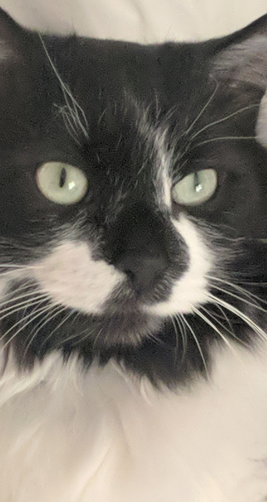

# About Me
####I assume my computer experience has been the same as everyone my age; I use computers to keep in touch with friends, family, school work, shopping, research, etc.  I guess one day I got curious and I ended up studying computer science!  The most interesting course I have had so far was the Discrete and Continuous Algorithms course.  That being said I am excited to spend time on entire projects instead of a handful of algorithms.
---
####I am sure everything I learned in this course will be very important, however I think the most important thing I can take away from this course is the fact that I came in with very little knowledge of the web.  For whatever reason I have been reluctant to take a look at the front end in general, and overcoming that means I will be less afraid to dive into other things that seem too big and too complicated to learn about.
---
